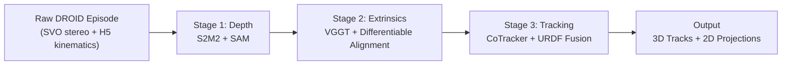

# DROID Multi-View 3D Point Tracking: Data Generation Pipeline

> **Status**: Draft for 3DV Multi-View TAP submission — DROID dataset section
>
> **Source code**: [pipeline.ipynb](../pipeline.ipynb) · [README.md](../README.md)

---

## Recommended Structure

This report is structured as a **dataset/pipeline technical section** suitable for inclusion as part of a larger paper or as supplementary material. The recommended LaTeX sections are:

```
\section{DROID Data Generation Pipeline}
  \subsection{Overview}
  \subsection{Stage 1: Metric Depth Estimation}
  \subsection{Stage 2: Camera Extrinsics Calibration}
  \subsection{Stage 3: Multi-View 3D Point Tracking}
  \subsection{Implementation Details}
```

---

## Section: DROID Data Generation Pipeline

### Overview

We process raw episodes from the DROID dataset [cite DROID] into dense multi-view 3D point tracks through a three-stage pipeline. Each DROID episode consists of a robot manipulation task recorded by 2–3 ZED stereo cameras (two external cameras and one wrist-mounted camera), with synchronized robot joint states and gripper telemetry. Our pipeline outputs, for each episode: (1) metric depth maps, (2) per-frame camera-to-world extrinsics, and (3) dense 3D point trajectories with per-camera 2D projections and visibility labels.



The pipeline is designed for automatic parallel execution across thousands of episodes. Each stage reads the outputs of previous stages from disk, enabling independent scaling and checkpointing. Table 1 summarizes the components used at each stage.

| Stage | Input | Models / Algorithms | Output |
|-------|-------|---------------------|--------|
| 1. Depth | ZED SVO stereo video, `trajectory.h5` | S2M2 (stereo matching), SAM ViT-H (segmentation) | Metric depth, gripper mask, calibration |
| 2. Extrinsics | Stage 1 depth + first frames | VGGT-1B (visual pose), differentiable rendering | Per-frame 4×4 camera-to-world transforms |
| 3. Tracking | Stage 1 depth + Stage 2 extrinsics + video | CoTracker3 (2D tracking), PyBullet (URDF FK) | Dense 3D point tracks + per-camera 2D tracks |

---

### Stage 1: Metric Depth Estimation

Stage 1 extracts metric depth maps from raw ZED stereo recordings. The pipeline consists of four sub-steps: SVO decoding, stereo depth estimation, gripper mask extraction, and gripper depth refinement.

#### SVO Decoding and Robot Kinematics

Each DROID episode stores stereo video in ZED's proprietary SVO format. We decode both rectified and unrectified left/right video streams along with per-frame intrinsics (focal length, principal point, distortion coefficients) and the stereo baseline (0.063m for wrist cameras, 0.120m for external cameras). Concurrently, we parse robot kinematics from the episode's HDF5 trajectory file, extracting 7-DOF joint positions, gripper states, and end-effector poses. We compute the static hand-eye transformation $T_\text{cam←ee}^\text{init}$ as:

$$T_\text{cam←ee}^\text{init} = T_\text{ee}(0)^{-1} \cdot T_\text{wrist\_ext}$$

where $T_\text{ee}(0)$ is the end-effector pose at the first frame and $T_\text{wrist\_ext}$ is the pre-calibrated wrist camera extrinsic from the DROID metadata.

#### S2M2 Stereo Depth

We apply S2M2 [cite S2M2], a state-of-the-art stereo matching model (XL variant, with `torch.compile` acceleration and 3 refinement iterations), to each frame independently. Disparity maps are converted to metric depth via:

$$Z = \frac{f_x \cdot b}{d}$$

where $f_x$ is the focal length, $b$ is the stereo baseline, and $d$ is the predicted disparity. We zero out pixels with S2M2 confidence below 0.95 to suppress unreliable matches.

#### Gripper Mask Extraction via SAM

The wrist camera captures the robot gripper as a permanent foreground object. To extract a clean gripper mask, we leverage SAM ViT-H [cite SAM] applied to frames where the gripper is closed (gripper position < 0.05). For each closed-gripper frame, we prompt SAM with 5 positive seed points in the lower image half (where the gripper typically appears) and 1 negative point in the upper half, along with a bounding box covering the lower image region. We filter candidate masks by area ratio (2%–45% of the image), scoring by $\text{SAM\_score} \times \text{area\_ratio}$.

A **consensus mask** is computed by pixel-wise majority voting across all closed-gripper frames (threshold 0.5), followed by extraction of the largest connected component. This produces a stable, view-consistent gripper segmentation.

#### Gripper Depth Refinement

Raw stereo depth is unreliable on the gripper due to specular surfaces and close-range stereo failure modes. We address this with a two-step distillation-and-injection approach:

1. **Distillation**: Within the consensus gripper mask, we collect depth values from closed-gripper frames (filtering to $Z < 0.15$m). We compute the per-pixel temporal median, producing a clean "template" gripper depth surface.

2. **Injection**: For closed-gripper frames, wherever the distilled template has a valid depth value, we replace the raw stereo depth with the template depth.

This ensures that gripper geometry is consistently represented across frames, which is critical for downstream extrinsics calibration and tracking.

---

### Stage 2: Camera Extrinsics Calibration

Stage 2 recovers per-frame camera-to-world 4×4 extrinsic matrices for all cameras. The approach combines visual priors from VGGT with differentiable rendering-based alignment against the known robot geometry.

#### VGGT Visual Initialization

When pre-calibrated extrinsics are unavailable, we initialize camera poses using VGGT-1B [cite VGGT], a vision transformer for multi-view pose estimation. We feed the first-frame images from all cameras to VGGT, obtaining pairwise relative poses. Using the wrist camera as an anchor (whose absolute pose is known from robot kinematics), we chain relative transforms to obtain initial world-frame estimates for all cameras:

$$T_\text{ext←world} = T_\text{ref←world} \cdot T_\text{ref←tgt}^{-1}$$

where $T_\text{ref←world} = T_\text{wrist←base}(0) \cdot T_\text{ref←wrist}$.

#### Differentiable Camera-Robot Alignment

We refine each camera's extrinsic independently by minimizing a depth re-projection loss against the known robot body geometry. We represent the robot as a dense point cloud of $\sim$100K surface points sampled proportionally to mesh face area from the Franka Panda + Robotiq 2F-85 URDF model. For each frame, forward kinematics maps these CAD points to world coordinates.

The optimization uses a 6-DOF incremental parameterization $\delta = [\mathbf{r}, \mathbf{t}] \in \mathbb{R}^6$, where $\mathbf{r}$ is an axis-angle rotation and $\mathbf{t}$ is a translation, applied multiplicatively to the current extrinsic:

$$T' = \Delta T(\delta) \cdot T_\text{current}$$

with $\Delta T$ constructed via the differentiable Rodrigues formula (with Taylor-series fallback for small angles $\|\mathbf{r}\|^2 < 10^{-8}$).

The depth re-projection loss projects robot CAD points into the camera, samples the observed depth map via bilinear interpolation (`grid_sample`), and penalizes the difference between predicted and observed depth. We apply front-face culling (surface normal dot product < 0) and depth tolerance filtering (0.15m for external cameras). The optimization runs Adam for 500 steps at learning rate $10^{-3}$.

For the **wrist camera**, the optimization operates in end-effector frame using gripper-only CAD points, as the gripper is the only robot element visible.

#### Global Joint Optimization

After independent calibration, we jointly optimize all camera extrinsics simultaneously with a combined loss:

$$\mathcal{L}_\text{total} = \mathcal{L}_\text{chamfer} + \lambda_\text{robot} \cdot \sum_{c} \mathcal{L}_\text{robot}^{(c)}$$

where:
- $\mathcal{L}_\text{chamfer}$ is the pairwise truncated Chamfer distance (cutoff 5cm) between environment point clouds from different cameras, using 2000 randomly downsampled points per frame per camera.
- $\mathcal{L}_\text{robot}^{(c)}$ is the camera-robot depth alignment loss for camera $c$.
- $\lambda_\text{robot} = 1.0$.

This joint optimization ensures multi-view geometric consistency while maintaining alignment with the robot.

---

### Stage 3: Multi-View 3D Point Tracking

Stage 3 produces dense 3D point trajectories by combining learning-based 2D tracking with multi-view geometry and robot forward kinematics. We process environment points and robot points separately, then merge the results.

#### Environment Tracking

**Phase 1 — Per-View 2D Tracking.**
We run CoTracker3 [cite CoTracker] in offline mode (grid_size=30, query_frame=0) on each camera view independently, producing per-camera 2D tracks $\tau^{(c)} \in \mathbb{R}^{T \times N_c \times 2}$ and visibility masks $v^{(c)} \in \{0,1\}^{T \times N_c}$ (threshold > 0.5).

**Phase 2 — 3D Lift and Robot Filtering.**
At $t=0$, we render the robot mask via PyBullet (dilated by a 15×15 kernel for safety margin). Track seed points falling on the robot are removed. Remaining environment points are lifted to 3D world coordinates via unprojection with the calibrated extrinsics and metric depth (filtering to $0.05\text{m} < Z < 5.0\text{m}$).

**Phase 3 — Cross-View 3D Deduplication.**
We concatenate 3D seed points from all views and merge nearby points using a **Union-Find** algorithm on a kd-tree with merge radius $r = 1.5$cm, producing a unified set of $N_\text{unified}$ canonical 3D points (positioned at the median of each merged group).

**Phase 4 — Cross-View Completion.**
For each camera, we identify unified points that were not natively tracked in that view. These "missing" points are projected into the camera at 5 keyframes (evenly spaced across the video), with occlusion checks (sensor depth ≥ predicted depth − 2cm). CoTracker is re-run in query mode (with backward tracking) from each keyframe, and 2D trajectories from multiple keyframes are fused via per-coordinate temporal median.

**Phase 5 — Multi-View 3D Fusion.**
For each (frame, point), we unproject from every camera view that has a valid 2D observation, then compute the **coordinate-wise median** across views to produce the final 3D trajectory. Temporal gaps are filled via linear interpolation, followed by Gaussian smoothing ($\sigma = 1.5$). Points visible in fewer than 2 camera views or fewer than 5 total frames are discarded.

#### Robot Tracking via URDF Forward Kinematics

We track robot surface points using the known URDF model and recorded joint states, bypassing appearance-based tracking entirely.

At $t=0$, we render a per-link segmentation map via PyBullet and identify CoTracker seed points on the robot surface (after 7px erosion). For each seed point, we compute its coordinates in the local frame of its bound link:

$$\mathbf{p}_\text{local} = T_\text{link}(0)^{-1} \cdot \mathbf{p}_\text{world}(0)$$

For subsequent frames, we update the joint configuration in PyBullet and propagate each local point through the new link transform:

$$\mathbf{p}_\text{world}(t) = T_\text{link}(t) \cdot \mathbf{p}_\text{local}$$

Visibility at each frame is determined by three conditions:
1. The projected 2D point is within image bounds
2. Not self-occluded: $Z_\text{pred} \leq Z_\text{URDF} + 1.5\text{cm}$
3. Not environment-occluded: $Z_\text{pred} \leq Z_\text{sensor} + 2\text{cm}$

Robot 3D trajectories are projected to all camera views using the same visibility checks, producing per-camera 2D robot tracks.

#### Track Merging and Export

Environment tracks (type=0) and robot tracks (type=1) are concatenated along the point dimension. The final output per episode consists of:
- Global 3D tracks: $\mathbf{T} \in \mathbb{R}^{T \times N \times 3}$, visibility $\mathbf{V} \in \{0,1\}^{T \times N}$
- Per-camera 2D tracks: $\mathbf{T}^{(c)} \in \mathbb{R}^{T \times N \times 2}$, visibility $\mathbf{V}^{(c)} \in \{0,1\}^{T \times N}$
- Per-camera intrinsics $(f_x, f_y, c_x, c_y)$ and world-to-camera extrinsics $T^{T \times 4 \times 4}$
- Point type labels (environment vs. robot)

---

### Implementation Details

**Scale.** We process all valid DROID episodes where camera serial mapping, episode paths, and pre-calibrated extrinsics are jointly available. Each stage supports multi-GPU distributed execution via rank/world-size parallelism with file-locked progress tracking.

**Frame selection.** We use the DROID-provided `keep_ranges` metadata to select action-relevant frames, discarding idle periods. Videos are bounded between 48 and 250 frames.

**Model weights.** S2M2 XL weights from HuggingFace (`minimok/s2m2`); CoTracker3 offline checkpoint from HuggingFace (`facebook/cotracker3`); SAM ViT-H weights from Meta; VGGT-1B from HuggingFace (`facebook/VGGT-1B`, auto-downloaded).

**Robot model.** We use the Franka Panda + Robotiq 2F-85 URDF (`franka_panda_robotiq_2f85_og.urdf`). Surface points (100K) are sampled proportionally to mesh face area, with camera-attached meshes downweighted by $10^{-4}$. Gripper angle is mapped as: $\theta = \text{clip}(g, 0, 1) \times 0.8028 - 0.08$, where $g$ is the gripper state from telemetry.

**Key hyperparameters.** Table 2 summarizes important thresholds and parameters.

| Parameter | Value | Stage | Purpose |
|-----------|-------|-------|---------|
| S2M2 confidence threshold | 0.95 | 1 | Disparity filtering |
| Stereo baseline (wrist / external) | 0.063m / 0.120m | 1 | Depth from disparity |
| Closed gripper threshold | < 0.05 | 1 | SAM mask frame selection |
| SAM mask area ratio | 2%–45% | 1 | Mask quality filter |
| Gripper depth ceiling | 0.15m | 1 | Depth distillation |
| Optimization steps / learning rate | 500 / 10⁻³ | 2 | Adam for alignment |
| Depth tolerance (external cameras) | 0.15m | 2 | Robot loss filtering |
| Chamfer distance cutoff | 5cm | 2 | Truncated loss |
| Chamfer downsampling | 2000 pts/frame | 2 | Computational budget |
| CoTracker grid size | 30 | 3 | 2D tracking density |
| Robot mask dilation | 15×15 px | 3 | Env/robot separation |
| 3D deduplication radius | 1.5cm | 3 | Union-Find merge |
| Self-occlusion tolerance | 1.5cm | 3 | URDF visibility |
| Environment occlusion tolerance | 2cm | 3 | Depth-based visibility |
| Temporal smoothing $\sigma$ | 1.5 | 3 | Gaussian filter |
| Min. visible cameras / frames | 2 / 5 | 3 | Track quality filter |

---

## Notes for LaTeX Conversion

> **Converting to LaTeX**: This markdown is structured to map 1:1 to LaTeX sections. Key items to handle during conversion:
> - Mermaid diagram → TikZ figure or included PDF/PNG
> - Markdown tables → `\begin{table}...\end{table}` with `\caption` and `\label`
> - Inline math `$...$` → same in LaTeX
> - Display math `$$...$$` → `\begin{equation}...\end{equation}`
> - `[cite X]` → `\cite{X}` with proper BibTeX keys
> - Add figure references for: (1) pipeline overview diagram, (2) depth refinement visualization, (3) extrinsics alignment illustration, (4) tracking result examples

> **Figures to create**: The report would benefit from:
> 1. **Pipeline overview figure** — the 3-stage flow with example outputs at each stage
> 2. **Gripper depth refinement** — before/after comparison of raw vs. refined depth on wrist camera
> 3. **Extrinsics calibration** — robot point cloud overlay on camera depth, or cross-camera point cloud alignment
> 4. **Tracking results** — 2D track visualization on multiple views + 3D track point cloud
