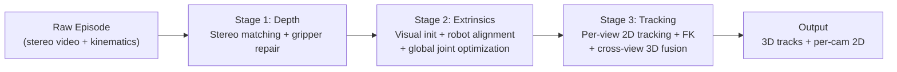

# Multi-View 3D Point Track Generation from DROID

> **Status**: Draft for 3DV Multi-View TAP Submission
>
> `[cite ...]` markers indicate references to be filled during LaTeX conversion.

---

## 1. Introduction and Motivation

3D point tracking can be approached from monocular video using learned depth estimation, but the resulting tracks lack metric accuracy and cross-view consistency. Multi-view setups with calibrated stereo cameras offer a path to higher-quality 3D annotations — provided the challenges of metric depth estimation, camera calibration, and cross-view fusion can be reliably solved. Generating such annotations at scale from real-world recordings is important for training and evaluating 3D point tracking models such as TAPVid-3D [cite TAPVid-3D].

The DROID dataset [cite DROID] presents a compelling opportunity for this task. As one of the largest real-world robot manipulation datasets, DROID provides multi-view stereo video from 2–3 synchronized ZED cameras per episode, precise robot kinematics (7-DOF joint states, gripper telemetry), and pre-calibrated camera parameters — recorded across diverse lab environments and manipulation tasks. These rich signals, if properly exploited, could enable the construction of high-quality 3D point tracks without additional manual annotation.

However, naively applying existing pipelines to DROID reveals three fundamental challenges:

1. **Depth quality on close-range robot surfaces.** Stereo matching degrades severely on the robot gripper visible in the wrist camera. At close range (< 15 cm), the disparity becomes very large and can exceed the stereo matching search range, leading to noisy or missing depth. The specular metallic surface further compounds the problem. The wrist-mounted camera — the most informative viewpoint for manipulation — is most affected.

2. **Camera extrinsics accuracy.** The DROID dataset spans hundreds of distinct physical setups with different camera mounting configurations. Pre-calibrated extrinsics, when available, may drift or be inaccurate. Even when multiple cameras are jointly optimized using robot alignment alone, this does not guarantee *multi-view geometric consistency* of the environment — a property essential for fusing observations across viewpoints into a single 3D coordinate frame.

3. **Cross-view tracking consistency.** Standard 2D tracking operates per-camera, producing independent sets of 2D trajectories with no shared identity across viewpoints. PointWorld follows this approach — each camera's 2D tracks are lifted to 3D independently, which is sufficient for per-view world model training. However, for multi-view 3D tracking, this results in duplicated, inconsistent 3D tracks that cannot be meaningfully compared or fused across views.

Prior work on DROID data processing, including the PointWorld pipeline [cite PointWorld], addresses these challenges with a general-purpose approach: FoundationStereo [cite FoundationStereo] for depth, VGGT [cite VGGT] for pose initialization, and per-camera CoTracker3 [cite CoTracker] for 2D tracking, with each camera processed independently. Notably, PointWorld processes only the two static external cameras by default, discarding the wrist-mounted camera entirely — arguably the most informative viewpoint for manipulation, as it captures close-up interactions between the gripper and objects. While this design is effective for single-view world model training (PointWorld's primary objective), it does not produce the multi-view consistent 3D tracks required for benchmarking and training 3D point tracking models, and leaves the wrist viewpoint — with its unique challenges and opportunities — entirely unexplored.

We present a three-stage pipeline specifically designed to exploit DROID's unique signals — calibrated stereo baselines, synchronized robot kinematics, and overlapping multi-camera viewpoints — to generate dense, multi-view consistent 3D point tracks. Our key contributions are:

- **Domain-aware depth**: We exploit the rigidity of the open gripper as a temporal prior to repair stereo depth failures on the wrist camera.
- **Globally consistent calibration**: We jointly optimize all camera extrinsics by enforcing cross-view geometric agreement via truncated Chamfer distance, in addition to per-camera robot alignment.
- **Multi-view 3D fusion**: We deduplicate, complete, and fuse tracks across viewpoints to produce a single set of globally consistent 3D trajectories with per-camera 2D projections.

---

## 2. Method

Our pipeline processes each DROID episode through three sequential stages. Each stage builds upon the outputs of the previous, progressively transforming raw stereo recordings and robot kinematics into dense, multi-view consistent 3D point tracks.

### 2.1 Stage 1: Metric Depth with Gripper Refinement

**Stereo depth estimation.** Following prior work (e.g., PointWorld uses FoundationStereo [cite FoundationStereo]), we obtain metric depth from calibrated stereo pairs via stereo matching. We use S2M2 [cite S2M2], which achieves competitive or superior performance on standard benchmarks with a simpler deployment footprint. We apply aggressive confidence filtering, zeroing out disparities with confidence below 0.95. The rationale is that missing depth is recoverable (other frames or cameras can fill in), but incorrect depth silently corrupts extrinsics calibration and 3D fusion.

**Gripper depth distillation.** While stereo depth estimation itself is standard, a key failure mode remains unaddressed by prior pipelines: the wrist camera captures the robot gripper as a permanent foreground object, and stereo matching fails on it because (1) the close-range geometry (< 15 cm) produces very large disparities that can exceed the stereo search range, and (2) the specular metallic surface further degrades matching quality. PointWorld sidesteps this issue by excluding the wrist camera entirely; we instead repair it.

We exploit a key domain insight: **the gripper starts each episode in a fixed open position, making it a rigid body with constant depth surface across these frames.** This allows us to distill a clean gripper depth from the noisy stereo observations across time:

1. **Segmentation**: We extract a gripper mask using SAM [cite SAM] in a zero-shot manner — requiring no robot-specific training data. A consensus mask is computed by pixel-wise majority voting across frames where the gripper is in its initial open state (gripper position < 0.05) to stabilize against per-frame prediction variance. We use SAM rather than projecting the URDF model because the hand-eye transform is uncalibrated at this stage — that calibration occurs in Stage 2.

2. **Temporal median**: Within the consensus mask, we compute the per-pixel temporal **median** depth across all initial-state frames. The median is robust to per-frame stereo noise, unlike the mean which would blur specular artifacts rather than suppress them.

3. **Injection**: For frames where the gripper remains in its initial open state, the distilled template depth replaces the raw stereo depth within the mask, ensuring that downstream stages receive clean, consistent gripper geometry.

*Limitation.* This refinement applies only to the initial open-gripper state. Once the gripper begins grasping (closing), finger positions vary across frames and the rigidity prior no longer holds. Extending to arbitrary gripper configurations via FK-predicted finger geometry is a direction for future work.

### 2.2 Stage 2: Differentiable Extrinsics Calibration

The key insight of this stage is that independent per-camera calibration — even with perfect depth and pose priors — does not guarantee *multi-view geometric consistency*. Our approach therefore combines per-camera robot alignment with a global joint optimization that enforces cross-camera agreement.

**Initialization.** We initialize camera poses using VGGT [cite VGGT], a vision transformer that estimates multi-view relative poses from images. Using the wrist camera as anchor (its pose is known from robot kinematics), we chain relative transforms to obtain initial absolute poses for external cameras. When DROID metadata provides pre-calibrated extrinsics, we run the subsequent optimization from both initializations and select the result with lower final loss. This is preferable to COLMAP/SfM (which is unreliable in scenes dominated by the self-similar, reflective robot body) or PnP (which requires 3D–2D correspondences not available before calibration).

**Per-camera robot alignment.** We refine each camera's extrinsic by minimizing a differentiable depth re-projection loss against the known robot geometry. The robot is represented as a dense surface point cloud from the URDF model. For each frame, forward kinematics maps CAD points to world coordinates, which are projected into the camera. The loss penalizes the L1 difference between the projected and observed depth, with front-face culling and depth tolerance filtering to handle self-occlusion and outliers. The wrist camera is handled separately: the optimization operates in end-effector frame, effectively learning the actual hand-eye transformation $T_\text{cam→ee}$.

**Global joint optimization.** After independent calibration, we jointly optimize all camera extrinsics simultaneously with a combined loss:

$$\mathcal{L}_\text{total} = \mathcal{L}_\text{chamfer} + \lambda_\text{robot} \cdot \sum_{c} \mathcal{L}_\text{robot}^{(c)}$$

The cross-camera term $\mathcal{L}_\text{chamfer}$ is the pairwise **truncated Chamfer distance** between environment point clouds from different cameras. Truncation (at 5 cm) is essential: without it, non-overlapping field-of-view regions dominate the loss. This loss directly enforces the geometric consistency required for multi-view fusion — when extrinsics are correct, environment point clouds from different cameras should overlap in 3D. The per-camera robot alignment loss $\mathcal{L}_\text{robot}^{(c)}$ prevents the Chamfer loss from drifting cameras away from the robot.

The critical difference from PointWorld is the cross-view Chamfer term. Although PointWorld places all camera parameters in a single optimizer, each camera's loss depends only on its own robot depth alignment — there is no cross-camera coupling, making it mathematically equivalent to independent per-camera optimization. Robot-only alignment can succeed per-camera while leaving the environment geometrically inconsistent across views, because the robot occupies only a small fraction of the scene. Our Chamfer loss introduces the missing cross-camera coupling by directly penalizing environment inconsistency.

### 2.3 Stage 3: Multi-View 3D Point Tracking

The final stage produces dense 3D point trajectories with per-camera 2D projections and visibility labels. We employ a **dual-track architecture** that processes environment points and robot points through fundamentally different mechanisms.

#### Environment Tracking

**Per-view 2D tracking.** We run CoTracker3 [cite CoTracker] in offline mode on each camera independently. We choose the offline model over online mode (used in PointWorld with 16-frame clips) because it processes the full video at once, producing more temporally consistent tracks without clip-stitching artifacts and preserving long-range correspondences.

**3D lift with robot-environment separation.** Track seed points are separated into environment and robot using a rendered robot mask. Remaining environment points are lifted to 3D world coordinates via unprojection with calibrated depth and extrinsics.

**Cross-view 3D deduplication.** A naive approach would treat each camera's lifted 3D points as independent, resulting in duplicate representations of the same physical surface point. We merge duplicates using a **Union-Find algorithm** over a kd-tree: any two seed points from different cameras within a merge radius of 1.5 cm in 3D are considered the same physical point. The canonical position is the coordinate-wise median of each merged group. Union-Find is preferred over alternatives such as Hungarian matching ($O(N^3)$, does not scale) or greedy nearest-neighbor (order-dependent). The 1.5 cm threshold is chosen to match the typical stereo depth noise level while preserving spatial detail.

**Cross-view completion.** After deduplication, each camera is likely "missing" tracks for many unified points — either due to field-of-view differences or seed point selection. We project missing points into each camera at **multiple keyframes** spaced across the video, with occlusion checks, and re-run CoTracker in query mode. Using multiple keyframes (rather than one) dramatically increases the probability that at least one captures the point unoccluded, yielding substantially more complete per-view coverage. Tracks from multiple keyframes are fused via per-coordinate temporal median.

**Multi-view 3D fusion.** For each (frame, point) pair, we unproject from every camera with a valid 2D observation and compute the **coordinate-wise median** across views. The median is robust to single-view outliers (wrong depth, extrinsics error), effectively ignoring the worst-case camera. Temporal gaps are filled via linear interpolation and Gaussian smoothing. Points visible in fewer than 2 camera views or 5 total frames are discarded as unreliable.

#### Robot Tracking via Forward Kinematics

Tracking the robot via appearance is fundamentally ill-posed: the robot body is self-similar, specular, and often partially occluded. We bypass appearance-based tracking entirely by exploiting the known kinematic model.

Each seed point on the robot surface is assigned to its nearest link and expressed in that link's local coordinate frame at $t=0$. For subsequent frames, forward kinematics propagates each point through the updated link transform, producing *exact* 3D trajectories (up to kinematic model accuracy). Visibility in each camera is determined by bounds checking, self-occlusion (against the rendered URDF depth), and environment occlusion (against the sensor depth).

Unlike PointWorld, which tracks only gripper-attached points via FK, our pipeline tracks points on **all robot links** (arm segments, joints, and gripper), providing substantially more complete robot surface coverage for downstream evaluation.

#### Merging and Output

Environment tracks and robot tracks are concatenated with type labels (environment vs. robot). The output format — global 3D tracks $\mathbf{T} \in \mathbb{R}^{T \times N \times 3}$, per-camera 2D tracks, visibility labels, and calibration data — is directly compatible with the TAPVid-3D [cite TAPVid-3D] evaluation protocol.

---

## 3. Comparison with PointWorld

PointWorld [cite PointWorld] processes DROID data with a similar three-stage architecture but targets a different objective: per-camera 3D point flows for single-view world model training. Our pipeline targets multi-view consistent 3D point tracks for 3D tracking evaluation. This difference in objective drives the key architectural distinctions:

| Component | PointWorld | Ours | Motivation |
|-----------|-----------|------|------------|
| **Gripper depth** | ❌ Not addressed | ✅ Temporal median distillation | Exploits initial-state rigidity to repair stereo failures |
| **Extrinsics** | Per-camera robot-depth (no cross-camera coupling) | Robot-depth + **cross-view Chamfer** | Robot-only alignment ≠ environment consistency |
| **Multi-view fusion** | ❌ Each camera independent | ✅ Dedup + completion + median fusion | Essential for globally consistent 3D tracks |
| **Wrist camera** | ❌ Excluded by default | ✅ Fully integrated | Most informative viewpoint for manipulation |
| **2D tracker mode** | Online (16-frame clips) | **Offline** (48-frame clips) | No clip stitching; better long-range consistency |
| **Robot tracking** | FK for gripper only | FK for **all robot links** | Full robot surface coverage |
| **Hand-eye calibration** | Uses kinematic GT only | Optimizes $T_\text{cam→ee}$ | Accounts for actual mounting offset |

PointWorld's per-camera design is *intentional* — their downstream world model consumes single-camera observations. Our cross-view fusion is necessary because our downstream task (TAPVid-3D) requires globally consistent 3D tracks with multi-camera visibility labeling.

---

## 4. Results

We report statistics over the **5,371 episodes** for which all three pipeline stages completed successfully, out of 5,580 processed (96.3% success rate). 209 episodes failed at Stage 3 (tracking), yielding no output.

### 4.1 Dataset Statistics

| Metric | Value |
|--------|-------|
| Total candidate episodes | 24,044 |
| Episodes processed (all 3 stages) | 5,580 |
| Episodes with complete 3D tracks | **5,371** (96.3%) |
| Episodes failed at Stage 3 (tracks) | 209 (3.7%) |
| Average frames per episode | **160** (median 159, range 49–251) |
| Average cameras per episode | **3.0** |
| Average 3D points per episode | **1,227** (env 938 / robot 290) |
| Average track length (frames) | **89** (median 85) |
| % points visible in all frames | 23.4% |
| Average cameras per point (any frame) | **2.29** |
| Average points per frame (visible) | 695 |
| Median scene spatial extent | 3.9 m |
| Average per-frame 3D displacement | 2.25 mm/frame |
| Average total 3D displacement per point | 184 mm |
| Total tracks data size | **24.6 GB** (avg 4.6 MB/episode) |

### 4.2 Self-Consistency Evaluation

In the absence of ground-truth 3D depth in DROID, we evaluate pipeline quality via self-consistency metrics.

**Reprojection error.** Fused 3D tracks are projected back to each camera using calibrated extrinsics and intrinsics. The L2 distance between reprojected and original 2D tracks measures the consistency between 3D fusion and per-camera 2D tracking. Measured over ~1.8 billion point-frame-camera observations across 5,371 episodes.

| Metric | Value |
|--------|-------|
| Median reprojection error (px) | **0.79 px** (mean of per-episode medians) |
| Mean reprojection error (px) | 9.25 px (mean of per-episode means) |
| 95th percentile (px) | 24.4 px (mean of per-episode p95) |

> **Note on outliers.** The mean is inflated by a small number of episodes with poor extrinsics convergence (worst episode mean: 479 px). The median (0.79 px) is the more representative metric, indicating that the majority of tracks are tightly self-consistent.

**Multi-view visibility.** The fraction of visible point-frame pairs observed from $\geq 2$ cameras measures the effectiveness of cross-view completion.

| Metric | Value |
|--------|-------|
| % observations from ≥ 2 cameras | **100%** |
| Average cameras per visible point-frame | **2.19** |

### 4.3 Qualitative Results

> **[TODO: Add figures]**
> 1. Pipeline overview with representative intermediate outputs
> 2. Gripper depth: raw stereo vs. refined
> 3. Extrinsics: cross-camera point cloud alignment before/after joint optimization
> 4. Tracking: 2D overlay on all views; 3D point cloud colored by type

---

## 5. Limitations and Future Work

**Gripper depth** applies only to the initial open-gripper state. Once grasping begins and finger positions vary, the rigidity prior no longer holds. FK-predicted finger geometry could address this in future work.

**Evaluation.** Without ground-truth depth, our quantitative evaluation relies on self-consistency metrics. Downstream task performance (e.g., 3D tracking model training on our data) would provide complementary evidence of data quality.

**Scale.** Processing the full 24K-episode DROID dataset requires additional engineering effort on failure handling and compute scaling.

---

## 6. Implementation Details

**Data format.** Each DROID episode stores stereo video in ZED SVO format. We extract rectified/unrectified stereo pairs, per-frame intrinsics, and stereo baselines (0.063 m wrist / 0.120 m external). Robot kinematics (7-DOF joints, gripper state, end-effector pose) are parsed from the episode HDF5 file. Frame selection follows DROID's `keep_ranges` metadata (action-relevant segments only, bounded to 48–250 frames).

**Models.** S2M2 XL (`minimok/s2m2`, with `torch.compile` and 3 refinement iterations); SAM ViT-H; VGGT-1B (`facebook/VGGT-1B`); CoTracker3 offline (`facebook/cotracker3`).

**Robot model.** Franka Panda + Robotiq 2F-85 URDF. 100K surface points sampled proportionally to mesh face area; camera-attached meshes downweighted by $10^{-4}$. Gripper angle: $\theta = \text{clip}(g, 0, 1) \times 0.8028 - 0.08$. PyBullet (headless, EGL) for rendering and segmentation.

**Extrinsics optimization.** 6-DOF axis-angle + translation parameterization with differentiable Rodrigues formula (Taylor fallback for $\|\mathbf{r}\|^2 < 10^{-8}$). Four-stage pipeline: (0) dataset pre-calibration, (1) VGGT anchoring, (2) per-camera robot alignment (Adam, 500 steps, lr $10^{-3}$), (3) global joint optimization (500 steps). Robot depth loss uses front-face culling and 0.15 m depth tolerance. Chamfer loss uses 2000 downsampled points per camera per frame with 5 cm truncation.

**Tracking details.** CoTracker: grid\_size=30, query\_frame=0, offline mode. Robot mask: PyBullet rendering with 15×15 px dilation. Union-Find dedup: 1.5 cm radius. Cross-view completion: 5 keyframes (frames 0, $T/4$, $T/2$, $3T/4$, $T{-}1$), query mode with backward tracking. Fusion: coordinate-wise nanmedian, linear interpolation for gaps, Gaussian smoothing ($\sigma=1.5$). Quality filter: $\geq$ 2 cameras, $\geq$ 5 visible frames. Robot seed erosion: 7 px. Visibility tolerances: 1.5 cm (self-occlusion), 2.0 cm (environment occlusion).

---

## Notes for LaTeX Conversion

> - Mermaid diagram → figure
> - `[cite X]` → `\cite{X}`
> - `[TODO]` → fill from `compute_stats.py`
> - Section numbering adjustable for main paper vs. supplementary

### References:
DROID, TAPVid-3D, PointWorld (arXiv:2601.03782), S2M2, SAM, VGGT-1B, CoTracker3, FoundationStereo, Depth Anything, DPT
